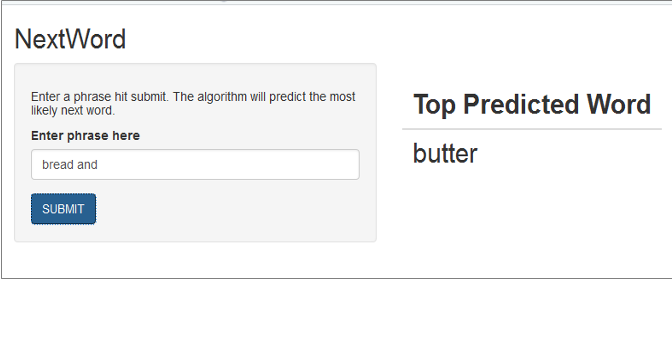

```{r setup, include=FALSE}
knitr::opts_chunk$set(echo = FALSE)
```
##Overview
###Text prediction is a common problem in the everyday world ranging from search engines to text messaging. It is by no means an easy task though due to the vast number of words in a language and the variety of orders in which they can be used.

##The App
####Here I introduce a simple app named NextWord to perform text prediction. All a user is required to do is enter a phrase in the box and hit submit. Then, the next word with the highest probability is returned.



##The Algorithm
#### The algorithm behind the app was built by using real word training text from sources like Twitter, blogs, and news articles. A prediction model was built by first creating ngrams, which are sequences of n words (bigram = 2 words, trigram = 3 words). These ngrams were then ranked to determine those with the highest probability. A back-off model was then used to predict the next word based on an input phrase. The input phrase is compared with the training set of ngrams and the one with the highest probability is returned. In the case of the input phrase not existing in the training data, it is iteratively shortened from the front end and the process repeated until a suitable word can be found.

##Performance
####Text prediction is difficult. Analysis was done on an independent set of data, and the current accuracy levels are shown in the table below for different lengths of input phrases to the app.

```{r, cache=FALSE}
source("testModel.R")
```
|Length of Input|Accuracy|
|---------------|--------|
|1|`r round(numcorrect.all[2]/numtest.all[2],2)`|
|2|`r round(numcorrect.all[3]/numtest.all[3],2)`|
|3|`r round(numcorrect.all[4]/numtest.all[4],2)`|
|4|`r round(numcorrect.all[5]/numtest.all[5],2)`|